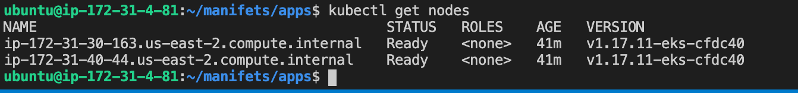
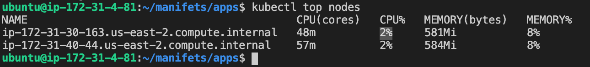
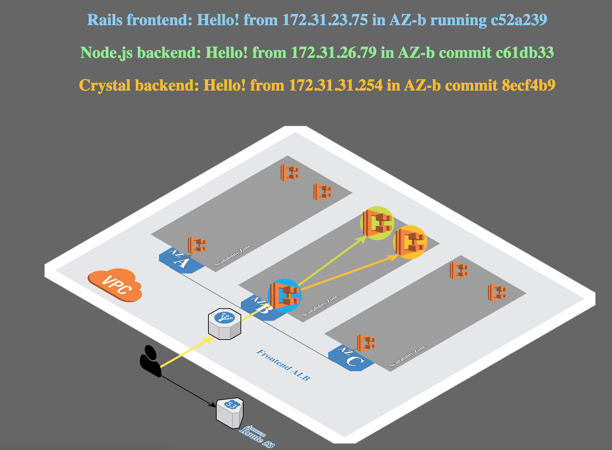
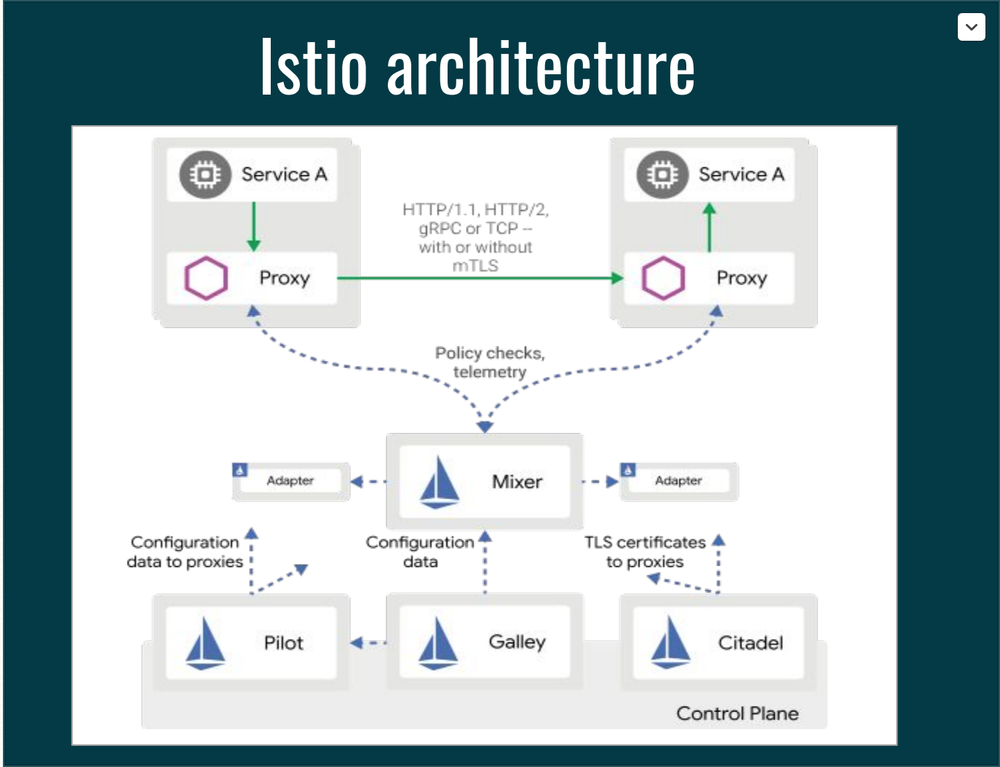

## Amazon Elastic K8s Service


Amazon Elastic Kubernetes Service (Amazon EKS) is a fully managed [Kubernetes](https://aws.amazon.com/kubernetes/) service. Customers such as Intel, Snap, Intuit, GoDaddy, and Autodesk trust EKS to run their most sensitive and mission critical applications because of its security, reliability, and scalability.


**Statement:**

need to launch below config deployments::

- app1.hypercloud.in -> eks demo app

- app2.hypercloud.in  -> wordpress site

- grafana.hypercloud.in  -> grafana dashboard

- kiali.hypercloud.in  -> kiali dashboard

- kibana.hypercloud.in  -> kibana dashboard

- prometheous.hypercloud.in  -> prometheous dashboard

**Installation Guide:**

- Launch Host instance 

  > Incase if you'll get subnet not found error while launching eps cluster try to configure your aws config

  

  ```
  sudo apt  install awscli -y
  #install eksctl
  curl --silent --location "https://github.com/weaveworks/eksctl/releases/latest/download/eksctl_$(uname -s)_amd64.tar.gz" | tar xz -C /tmp
  
  sudo mv -v /tmp/eksctl /usr/local/bin
  eksctl version
  eksctl completion bash >> ~/.bash_completion
  . /etc/profile.d/bash_completion.sh
  . ~/.bash_completion
  
  #install kubectl 
  curl -LO "https://storage.googleapis.com/kubernetes-release/release/$(curl -s https://storage.googleapis.com/kubernetes-release/release/stable.txt)/bin/linux/amd64/kubectl"
  
  chmod +x ./kubectl
  sudo mv ./kubectl /usr/local/bin/kubectl
  kubectl version --client
  
  #launch eks cluster on existing vpc
  eksctl create cluster   --vpc-public-subnets=subnet-f4406e8e,subnet-2c55c360 --name=Thanos
  
  eksctl create cluster -f eksworkshop.yaml
  
  aws eks --region us-east-2 update-kubeconfig --name Thanos
  
  ```

- Install Kubernetes dashboard

  ```
  export DASHBOARD_VERSION="v2.0.0"
  
  kubectl apply -f https://raw.githubusercontent.com/kubernetes/dashboard/${DASHBOARD_VERSION}/aio/deploy/recommended.yaml
  
  kubectl proxy --port=8080 --address=0.0.0.0 --disable-filter=true &
  ```

  

- Install metrics server

  

  ```
  kubectl apply -f https://github.com/kubernetes-sigs/metrics-server/releases/download/v0.3.6/components.yaml
  
  kubectl get deployment metrics-server -n kube-system
  ```

- Install Demo Application

  

  ```
  git clone https://github.com/brentley/ecsdemo-frontend.git
  git clone https://github.com/brentley/ecsdemo-nodejs.git
  git clone https://github.com/brentley/ecsdemo-crystal.git
  
  copy all manifets from github/kubernetes and use kubectl to deploy them for example:
  kubectl apply -f deployment.yaml
  
  for checking all resources
  kubectl get all
  
  for checking services
  kubectl get svc
  
  ELB=$(kubectl get service ecsdemo-frontend -o json | jq -r '.status.loadBalancer.ingress[].hostname')
  curl -m3 -v $ELB
  ```

- Install istio(service mesh)

  Injection occurs at **pod creation time**. Kill the running pod and verify a new pod is created with the injected sidecar. The original pod has 1/1 READY containers and the pod with injected sidecar has 2/2 READY containers.

  

  ```
  #install istioctl
  curl -L https://istio.io/downloadIstio | sh -
  export PATH="$PATH:/home/ubuntu/manifets/istio-1.7.3/bin"
  
  istioctl install --set profile=default
  
  kubectl label namespace istio-system istio-injection=enabled
  
  kubectl logs productpage-v1-84f77f8747-8zklx -c productpage
  
  kubectl get pods | grep "ecsdemo-frontend" |  awk '{print $1}' | xargs kubectl delete pods
  ```


Eksctl.yaml

```
apiVersion: eksctl.io/v1alpha5
kind: ClusterConfig

metadata:
  name: my-test
  region: us-west-2

vpc:
  id: "vpc-11111"
  subnets:
    public:
      us-west-2d:
          id: "subnet-0153e560b3129a696"
      us-west-2c:
          id: "subnet-0cc9c5aebe75083fd"
      us-west-2a:
          id: "subnet-009fa0199ec203c37"
      us-west-2b:
          id: "subnet-018fa0176ba320e45"

nodeGroups:
  - name: ng-1-workers
    labels: { role: workers }
    instanceType: m5.xlarge
    desiredCapacity: 10
    volumeSize: 80
    privateNetworking: true
```

Frontend.yaml

```
apiVersion: v1
kind: ServiceAccount
metadata:
  name: frontend
---
apiVersion: apps/v1
kind: Deployment
metadata:
  name: ecsdemo-frontend
  labels:
    app: ecsdemo-frontend
  namespace: default
spec:
  replicas: 2
  selector:
    matchLabels:
      app: ecsdemo-frontend
  strategy:
    rollingUpdate:
      maxSurge: 25%
      maxUnavailable: 25%
    type: RollingUpdate
  template:
    metadata:
      labels:
        app: ecsdemo-frontend
    spec:
      serviceAccountName: frontend
      containers:
      - image: brentley/ecsdemo-frontend:latest
        imagePullPolicy: Always
        name: ecsdemo-frontend
        ports:
        - containerPort: 3000
          protocol: TCP
        env:
        - name: CRYSTAL_URL
          value: "http://ecsdemo-crystal.default.svc.cluster.local/crystal"
        - name: NODEJS_URL
          value: "http://ecsdemo-nodejs.default.svc.cluster.local/"
---
apiVersion: v1
kind: Service
metadata:
  name: ecsdemo-frontend
spec:
  selector:
    app: ecsdemo-frontend
  ports:
   -  protocol: TCP
      port: 80
      targetPort: 3000
```

Crystal-backend.yaml

```
apiVersion: apps/v1
kind: Deployment
metadata:
  name: ecsdemo-crystal
  labels:
    app: ecsdemo-crystal
  namespace: default
spec:
  replicas: 2
  selector:
    matchLabels:
      app: ecsdemo-crystal
  strategy:
    rollingUpdate:
      maxSurge: 25%
      maxUnavailable: 25%
    type: RollingUpdate
  template:
    metadata:
      labels:
        app: ecsdemo-crystal
    spec:
      containers:
      - image: brentley/ecsdemo-crystal:latest
        imagePullPolicy: Always
        name: ecsdemo-crystal
        ports:
        - containerPort: 3000
          protocol: TCP
---
apiVersion: v1
kind: Service
metadata:
  name: ecsdemo-crystal
spec:
  selector:
    app: ecsdemo-crystal
  ports:
   -  protocol: TCP
      port: 80
      targetPort: 3000
```

Node-backend.yaml

```
apiVersion: apps/v1
kind: Deployment
metadata:
  name: ecsdemo-nodejs
  labels:
    app: ecsdemo-nodejs
  namespace: default
spec:
  replicas: 2
  selector:
    matchLabels:
      app: ecsdemo-nodejs
  strategy:
    rollingUpdate:
      maxSurge: 25%
      maxUnavailable: 25%
    type: RollingUpdate
  template:
    metadata:
      labels:
        app: ecsdemo-nodejs
    spec:
      containers:
      - image: brentley/ecsdemo-nodejs:latest
        imagePullPolicy: Always
        name: ecsdemo-nodejs
        ports:
        - containerPort: 3000
          protocol: TCP
---
apiVersion: v1
kind: Service
metadata:
  name: ecsdemo-nodejs
spec:
  selector:
    app: ecsdemo-nodejs
  ports:
   -  protocol: TCP
      port: 80
      targetPort: 3000
```

Istio-ingress.yaml

```
apiVersion: networking.istio.io/v1alpha3
kind: Gateway
metadata:
  name: eks-gateway
spec:
  selector:
    istio: ingressgateway # use istio default controller
  servers:
  - port:
      number: 80
      name: http
      protocol: HTTP
    hosts:
    - "test.ashishranjan.live"
---
apiVersion: networking.istio.io/v1alpha3
kind: VirtualService
metadata:
  name: demoapp
spec:
  hosts:
  - "test.ashishranjan.live"
  gateways:
  - eks-gateway
  http:
  - route:
    - destination:
        host: ecsdemo-frontend
        port:
          number: 80
```


it's important to add tags on subnets

| Name                         | Value  |
| ---------------------------- | ------ |
| kubernetes.io/cluster/Thanos | shared |

